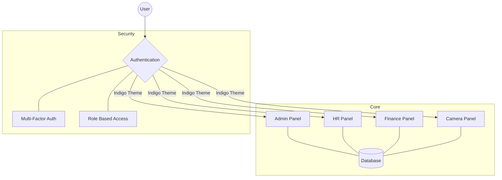

<div align="center">

# 💼 Comproller

**The Modern HR & Payroll Management System**  
*Built for speed, aesthetics, and enterprise-grade reliability.*

[](https://php.net)
[](https://laravel.com)
[](https://filamentphp.com)
[](https://tailwindcss.com)

---

</div>

## 🌐 System Architecture

Comproller maintains a modular, high-security ecosystem. Below is a high-level overview of our specialized panels:



## 💎 Key Features

| Feature | Description | Highlight |
| :--- | :--- | :--- |
| **Aurora UI** | Dynamic Indigo & Teal animated gradients. | ✨ Modern |
| **Typewriter** | Smooth character-by-character text entrance. | ⌨️ Interactive |
| **MFA Security** | Google Authenticator integration for all roles. | 🔒 Secure |
| **Modular Panels** | Separate contexts for HR, Finance, and Admin. | 🧩 Scalable |
| **Smart PDF** | Bulk generation for contracts and ID cards. | 📄 Efficient |

## 🛠️ Tech Stack

### 🏗️ Infrastructure
- **Framework:** Laravel 12+ (Latest)
- **Database:** PostgreSQL / MySQL / SQLite
- **Runtime:** PHP 8.5+

### 🎨 Frontend & UI
- **Admin Engine:** Filament v5
- **Reactivity:** Livewire 3
- **Styling:** Tailwind CSS v4-beta (Ultra-fast)
- **Design:** Glassmorphism & Aurora Gradients

## 📦 Installation & Quick Start

```bash
# 1. Clone & Enter
git clone https://github.com/ItzKssBerc/comproller.git && cd comproller

# 2. Automated Setup
# Installs dependencies, sets up the database, and builds assets.
composer setup
```

## 👨‍💻 Development

To start the local development environment:

```bash
composer dev
```

---

<div align="center">

Made with ❤️ by **Kiss Bercel**  
*Innovating HR management, one line of code at a time.*

</div>

---

<p align="center">
  Made with ❤️ by <strong>Kiss Bercel</strong><br>
  <em>Innovating HR management, one line of code at a time.</em>
</p>